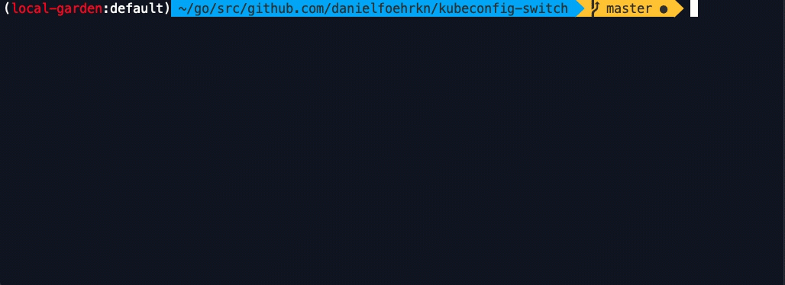

# Kubeswitch


[](https://github.com/danielfoehrKn/switch/actions?query=workflow%3A"Build")
[](https://goreportcard.com/badge/github.com/danielfoehrKn/kubeswitch)
[](https://opensource.org/licenses/Apache-2.0)

The kubectx for operators.

`kubeswitch` (lazy: `switch`) is the single pane of glass for all of your kubeconfig files.  
Caters to operators of large scale Kubernetes installations.
Designed as a [drop-in replacement](#difference-to-kubectx) for [kubectx](https://github.com/ahmetb/kubectx).

## Highlights

- **Unified search over multiple providers**
  - [Amazon Elastic Kubernetes Service (EKS)](docs/stores/eks/eks.md)
  - [Azure Kubernetes Service (AKS)](docs/stores/azure/azure.md)
  - [Gardener](docs/stores/gardener/gardener.md)
  - [Google Kubernetes Engine (GKE)](docs/stores/gke/gke.md)
  - [Hashicorp Vault](docs/stores/vault/use_vault_store.md)
  - [Local filesystem](docs/stores/filesystem/filesystem.md)
  - [Rancher](docs/stores/rancher/rancher.md)
  - Your favorite Cloud Provider or Managed Kubernetes Platform is not supported yet? Looking for contributions!
- **Change the namespace**
- **Change to any context and namespace from the history**
- **Terminal Window Isolation**
  - Each terminal window can target a different cluster (does not overwrite the current-context in a shared Kubeconfig)
  - Each terminal window can target the same cluster and set a [different namespace preference](https://kubernetes.io/docs/concepts/overview/working-with-objects/namespaces/#setting-the-namespace-preference)
- **Efficiency**: uses local caches for kubeconfig contexts and namespaces
- **Advanced Search Capabilities**
  - Hot reload capability (adds Kubeconfigs to the search on the fly - especially useful when searching large directories)
  - Live preview of the selected Kubeconfig file (**sanitized from credentials**)
  - Recursive search (e.g. on the local filesystem or in Vault)
  - Easily find clusters with [cryptic context names](#search-cryptic-context-names)
- **Easy Navigation**
  - Define alias names for contexts without changing the underlying Kubeconfig
- **Extensibility** 
  - Integrate custom functionality using [Hooks](./hooks/README.md) (comparable with Git pre-commit hooks).
  - Build your own integration e.g., synchronise Kubeconfig files of clusters from Git or remote systems.


## Non-goals

- To provide a customized shell prompt. Use [kube-ps1](https://github.com/jonmosco/kube-ps1).

## Installation

Kubeswitch can be installed using `brew` for OSX, MacPorts, from Github Releases or from source. 
Please [see the documentation](docs/installation.md).

## Usage 

```
$ switch -h
The kubectx for operators.

Usage:
  switch [flags]
  switch [command]

Available Commands:
  alias                Create an alias for a context. Use ALIAS=CONTEXT_NAME
  clean                Cleans all temporary and cached kubeconfig files
  completion           Generate the autocompletion script for the specified shell
  exec                 Execute any command towards the matching contexts from the wildcard search
  gardener             gardener specific commands
  help                 Help about any command
  history              Switch to any previous tuple {context,namespace} from the history
  hooks                Run configured hooks
  list-contexts        List all available contexts
  namespace            Change the current namespace
  set-context          Switch to context name provided as first argument
  set-last-context     Switch to the last used context from the history
  set-previous-context Switch to the previous context from the history
  version              show switch version info

Flags:
      --config-path string         path on the local filesystem to the configuration file. (default "/Users/tommyolsen/.kube/switch-config.yaml")
      --debug                      show debug logs
  -h, --help                       help for switch
      --kubeconfig-name string     only shows kubeconfig files with this name. Accepts wilcard arguments '*' and '?'. Defaults to 'config'. (default "config")
      --kubeconfig-path string     path to be recursively searched for kubeconfigs. Can be a file or a directory on the local filesystem or a path in Vault. (default "$HOME/.kube/config")
      --no-index                   stores do not read from index files. The index is refreshed.
      --show-preview               show preview of the selected kubeconfig. Possibly makes sense to disable when using vault as the kubeconfig store to prevent excessive requests against the API. (default true)
      --state-directory string     path to the local directory used for storing internal state. (default "/Users/tommyolsen/.kube/switch-state")
      --store string               the backing store to be searched for kubeconfig files. Can be either "filesystem" or "vault" (default "filesystem")
      --vault-api-address string   the API address of the Vault store. Overrides the default "vaultAPIAddress" field in the SwitchConfig. This flag is overridden by the environment variable "VAULT_ADDR".
  -v, --version                    version for switch

Use "switch [command] --help" for more information about a command.
```

Just type `switch` to search over the context names defined in the default Kubeconfig file `~/.kube/config`
or from the environment variable `KUBECONFIG`.

To recursively **search over multiple directories, files and Kubeconfig stores**, please see the [documentation](docs/kubeconfig_stores.md) 
to set up the necessary configuration file.

## Change namespace

Change the current namespace using `switch ns`
Uses a **self-updating** local namespace **cache** for instant search results.


## History

Similar to the command histories of a shell, `switch` keeps a history of used contexts and namespaces.
A history entry is always a tuple of `{context-name, namespace}`.
This allows to jump back to any context and namespace in the history.


In addition, use 
- `switch .` to change to the last used context and namespace (handy for new terminals)
- `switch -` to change to the previous history entry

## List and search for contexts

You can list all your indexed contexts by issuing the following command: `switch list-contexts`. 
And if you want to search for only parts of those contexts, you can use wildcard search:

```sh
switch list-contexts "*-dev-?"
```

Wildcard search supports [matching wildcards](https://en.wikipedia.org/wiki/Matching_wildcards) notation also known as globbing:

- `?` matches exactly one occurrence of any character.
- `*` matches arbitrary many (including zero) occurrences of any character.

## Execute commands

You can use the above wildcard search to execute any commands towards the matching clusters. This makes it powerful for quickly running a command through a given set of clusters and see the output of these commands:

```sh
switch exec "*-dev-?" -- kubectl get ns
```

You can also wrap the command(s) into a script and execute it via `switch exec`:

```sh
switch exec "*-dev-?" -- bash script.sh
```

For inline shell script execution, you need to specify the default shell in the `SwitchConfig` file:

```yaml
# ~/.kube/switch-config.yaml
kind: SwitchConfig
execShell: "/bin/bash"
```

Then you can run shell commands like so:
```sh
# executes /bin/bash -c 'for i in 1 2 3; do sleep 1; echo "hi $i"; done'
switch exec "*-dev-?" -- 'for i in 1 2 3; do sleep 1; echo "hi $i"; done'
```

## Kubeconfig stores

Multiple Kubeconfig stores are supported.
The local filesystem is the default store and does not require any additional setup.
However, if you intend to search for all Kubeconfig context/files in the `~/.kube` directory, 
please [first consider this](docs/kubeconfig_stores.md#additional-considerations).

To search over multiple directories and setup Kubeconfig stores (such as Vault), [please see here](docs/kubeconfig_stores.md).

## Kubeconfig cache

An cache for kubeconfig files can be added to a store to prevent loading from remote on each invocation of `kubeswitch`.
The kubeconfig file will be cached after first download.

To see how to configure the cache, [please see here](docs/kubeconfig_cache.md).

## Transition from Kubectx

Offers a smooth transition as `kubeswitch` is a 
drop-in replacement for _kubectx_.
You can set an alias and keep using your existing setup.
```
  alias kubectx='switch'
  alias kctx='switch'
```

However, that does not mean that `kubeswitch` behaves exactly like `kubectx`. 
Please [see here](#difference-to-kubectx) to read about some main differences to kubectx.

## Alias

An alias for any context name can be defined. 
An alias **does not modify** or rename the context in the kubeconfig file, 
instead it is just injected for the search.

Define an alias.

```
$ switch alias mediathekview=gke_mediathekviewmobile-real_europe-west1-c_mediathekviewmobile
```

It is also possible to use `switch alias <alias>=.` to create an alias for the current context.

See the created alias
```
$ switch alias ls
+---------------+-------------------------------------------------------------------------------+
| ALIAS         | CONTEXT                                                                       |
+---------------+-------------------------------------------------------------------------------+
| mediathekview | mediathekview/gke_mediathekviewmobile-real_europe-west1-c_mediathekviewmobile |
+---------------+-------------------------------------------------------------------------------+
| TOTAL         | 1                                                                             |
+---------------+-------------------------------------------------------------------------------+ 
```

Remove the alias

```
$ switch alias rm mediathekview
```

### Caching

See [here](docs/search_index.md) how to use a search index (cache) to speed up search operations.
Using the search index is especially useful when
- dealing with large amounts of Kubeconfigs and querying the Kubeconfig store is slow (e.g. searching a large directory)
- when using a remote systems (such as Vault) as the Kubeconfig store to increase search speed, reduce latency and save API requests

### Hot Reload

For large directories with many Kubeconfig files, the Kubeconfigs are added to the search set on the fly.
For smaller directory sizes, the search feels instantaneous.



## Search cryptic context names 

Unfortunately operators sometimes have to deal with cryptic or generated kubeconfig context names that make
it hard to guess which Kubernetes cluster this kubeconfig context actually points to.
For example, these could be temporary CI clusters.

Without having to manually change the Kubeconfig file, `kubeswitch` makes it easier to identify
the right context name by including the **direct parent path** name in the fuzzy search.
This way, the directory layout can actually convey information useful for the search.

To exemplify this, look at the path layout below. 
Each Kubernetes landscape (called `dev`, `canary` and `live`) have their own directory containing the Kubeconfigs 
of the Kubernetes clusters on that landscape.
Every `Kubeconfig` is named `config`.

```
$ tree .kube/my-path
.kube/my-path
├── canary
│   └── config
├── dev
│   ├── config
│   └── config-tmp
└── live
    └── config
```
This is how the search looks like for this directory.
The parent directory name is part of the search.


You can either manually create such a path layout and place the kubeconfigs, or write a [custom 
hook](hooks/README.md) (script / binary) to do that prior to the search.

### Extensibilty 

Customization is possible by using `Hooks` (think Git pre-commit hooks). 
Hooks can call an arbitrary executable or execute commands at a certain time (e.g every 6 hours) prior to the search via `kubeswitch`.
For more information [take a look here](./hooks/README.md).

### Difference to kubectx

`kubectx` is great when dealing with few Kubeconfig files - however lacks support when
operating large Kubernetes installations where clusters spin up on demand,
have cryptic context names or are stored in various kubeconfig stores (e.g., Vault).

`kubeswitch` is build for a world where Kubernetes clusters are [treated as cattle, not pets](https://devops.stackexchange.com/questions/653/what-is-the-definition-of-cattle-not-pets).
This has implications on how Kubeconfig files are managed. 
`kubeswitch` is fundamentally designed for the modern Kubernetes operator of large dynamic Kubernetes 
installations with possibly thousands of Kubeconfig files in [various locations](docs/kubeconfig_stores.md).

Has build-in
 - convenience features (terminal window isolation, context history, [context aliasing](#alias), [improved search experience](#search-cryptic-context-names), sanitized Kubeconfig preview);
 - advanced search capabilities (search index, hot reload);
 - as well as integration points with external systems ([hooks](hooks/README.md)).


In addition, `kubeswitch` is a drop-in replacement for _kubectx_.
You can set an alias and keep using your existing setup.
```
  alias kubectx='switch'
  alias kctx='switch'
```

However, that does not mean that `kubeswitch` behaves exactly like `kubectx`.

**Alias Names**

`kubectx` supports renaming context names using `kubectx <NEW_NAME>=<NAME>`.
Likewise, use `switch <NEW_NAME>=<NAME>` to create an alias.
An alias **does not modify** or rename the context in the kubeconfig file. 
It is just a local configuration that can be removed again via `switch alias rm <NAME>`.
Directly modifying the Kubeconfig is problematic: 
 - Common tooling might be used across the team which needs to rely on predictable cluster naming conventions
 - Modifying the file is not always possible e.g., when the Kubeconfig is actually stored in a Vault
 - No easy way to revert the alias or see aliases that are currently in use

**Terminal Window isolation**

`kubectx` directly modifies the kubeconfig file to set the current context.
This has the disadvantage that every other terminal using the same 
Kubeconfig file (e.g, via environment variable _KUBECONFIG_) will also be affected and change the context.

A guideline of `kubeswitch` is to not modify the underlying Kubeconfig file.
Hence, a temporary copy of the original Kubeconfig file is created and used to modify the context.
This way, each terminal window works on its own copy of the Kubeconfig file and cannot interfere with each other.

### Limitations

Please make sure there are no kubeconfig files that have the same context name within one directory.
Define multiple search paths using the [configuration file](docs/kubeconfig_stores.md).

### Future Plans

- Support more Cloud Providers and Managed Kubernetes Platforms (Rancher, ...)
