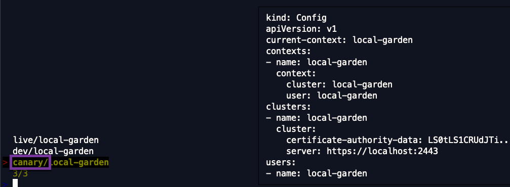

# Kubeconfig switch

`switch` is a tiny standalone tool, designed to conveniently switch between the context of hundreds of `kubeconfig` files without having to remember context names.

## Features

- Fuzzy search for `kubeconfig` files in a configurable location on the local filesystem.
- Terminal Window isolation
  - Each terminal window can target a different cluster (does not override the current-context in a shared kubeconfig).
  - Each terminal window can target the same cluster and set a [different namespace preference](https://kubernetes.io/docs/concepts/overview/working-with-objects/namespaces/#setting-the-namespace-preference) 
  e.g via the tool [kubens](https://github.com/ahmetb/kubectx).
- Efficient recursive search with hot reload (adding files when they are found - especially useful when searching large directories).
- Contexts are easily identifiable. The `context` is prefixed with the (immediate) parent folder name to allow to easily find the context you are looking for. 
- Live preview of the kubeconfig file (**sanitized from credentials**).
- Extensible with Hooks (comparable with Git pre-commit hooks).


## Installation

Mac users can just use `homebrew` for installation.

If you are running Linux, you would need to first compile the `switcher` binary for Linux yourself, put it in your path, and then source the `switch` script from [here](https://github.com/danielfoehrKn/kubeconfig-switch/blob/master/hack/switch/switch.sh).

#### Option 1 - Homebrew

Install both the `switcher` tool and the `switch` script with `homebrew`. 
```
 $ brew install danielfoehrkn/switch/switch
```

Source the `switch` script from the `homebrew` installation path.

```
$ source /usr/local/Cellar/switch/v0.0.3/switch.sh
```

Updating the version of the `switch` utility via `brew` (e.g changing from version 0.0.2 to 0.0.3) requires you to change the sourced path. 

#### Option 2 - Manual Installation

Install the `switcher` binary.
```
 $ brew install danielfoehrkn/switch/switcher
```
or download from [here](https://github.com/danielfoehrKn/kubeconfig-switch/blob/master/hack/switch/switcher).

Grab the `switch` bash script [from here](https://github.com/danielfoehrKn/kubeconfig-switch/blob/master/hack/switch/switch.sh), place it somewhere on your local filesystem and **source** it.
Where you source the script depends on your terminal (e.g .bashrc or .zsrhc).

`
$ source <my-path>/switch.sh
`
## Usage 

```
$ switch -h
Usage:
  --kubeconfig-directory directory containing the kubeconfig files. (default "~/.kube")
  --kubeconfig-name shows kubeconfig files with this name. Accepts wilcard arguments '*' and '?'. (default "config")
  --executable-path path to the 'switcher' executable. If unset tries to use 'switcher' from the path.
  --show-preview if it should show a preview. Preview is sanitized from credentials. (default "true")
  --hook-config-path path to the hook configuration file. (default "~/.kube/switch-config.yaml")
  --hook-state-directory path to the state directory. (default "~/.kube/switch-state")
  --help shows available flags.
  clean removes all the temporary kubeconfig files created in the directory "~/.kube/switch_tmp".
```
Just type `switch` to search for kubeconfig files with name `config` in the `~/.kube` directory. 
As shown above, there are multiple flags available to adjust this behaviour. 

To speed up the fuzzy search, I would recommend putting all the kubeconfig files into a single directory containing only kubeconfig files.
The default `~/.kube` directory contains a bunch of other files that have to be filtered out.

```
alias switch='switch --kubeconfig-directory ~/.kube/switch'
```

## Directory setup 

The `switch` tool just recursively searches through a specified directory for kubeconfig files matching a name.
The directory layout presented below is purely optional.

When dealing with a large amount of kubeconfig names, the `context` names are not necessarily unique or convey a meaning (especially when they are generated names).
To circumvent that issue, the fuzzy search includes the parent folder name.
This way, the directory layout can actually convey information useful for the search.

To exemplify this, look at the directory layout below. 
Each Kubernetes landscape (called `dev`, `canary` and `live`) have their own directory containing the kubeconfigs of the Kubernetes clusters on that landscape.
Every `kubeconfig` is named `config`.

```
$ tree .kube/switch
.kube/switch
├── canary
│   └── config
├── dev
│   ├── config
│   └── config-tmp
└── live
    └── confi
```
This is how the search looks like for this directory.
The parent directory name is part of the search.



### Extensibilty 

Customization is possible by using `Hooks` (think Git pre-commit hooks). 
Hooks can call an arbitrary executable or execute commands at a certain time (e.g every 6 hours) prior to the search via `switch`.
For more information [take a look here](./hooks/README.md). 


### Hot Reload

For large directories with many kubeconfig files, the kubeconfigs are added to the search set on the fly.
For smaller directory sizes, the search feels instantaneous.

 

### How it works

The tool sets the `KUBECONFIG` environment variable in the current shell session to a temporary copy of the selected `kubeconfig` file. 
This way different Kubernetes clusters can be targeted in each terminal window.

There are two separate tools involved. The first one is `switch.sh`, a tiny bash script, and then there is the `switcher` binary.
The only thing the `switch` script does, is calling the `switcher` binary, capturing the path to the user selected `kubeconfig` and then setting 
the `KUBECONFIG` environment variable.
In order for the script to set the environment variable in the current shell session, it has to be sourced.

The `switcher`'s job is to displays a fuzzy search based on a recursive directory search for `kubeconfig` files in the configured directory.
A temporary copy of the selected `kubeconfig` file is created in `~/.kube/switch_tmp`.
To clean all created temporary files use `switch clean`.

### Difference to [kubectx.](https://github.com/ahmetb/kubectx)

While [kubectx.](https://github.com/ahmetb/kubectx) is designed to switch between contexts in a kubeconfig file, 
this tool is best for dealing with many individual `kubeconfig` files.

Another difference is, that multiple terminal windows targeting the same cluster do not interfere with each other.
Each terminal window can target a different cluster and namespace.

### Limitations

- `homebrew` places the `switch` script into `/usr/local/Cellar/switch/v0.0.3/switch.sh`. 
This is undesirable as the file location contains the version. Hence for each version you currently need to change your configuration.
- Make sure that within one directory, there are no identical `kubeconfig` context names. Put them in separate folders. 
Within one `kubeconfig` file, the context name is unique. So the easiest way is to just put each `kubeconfig` file in 
its own directory with a meaningful name.
