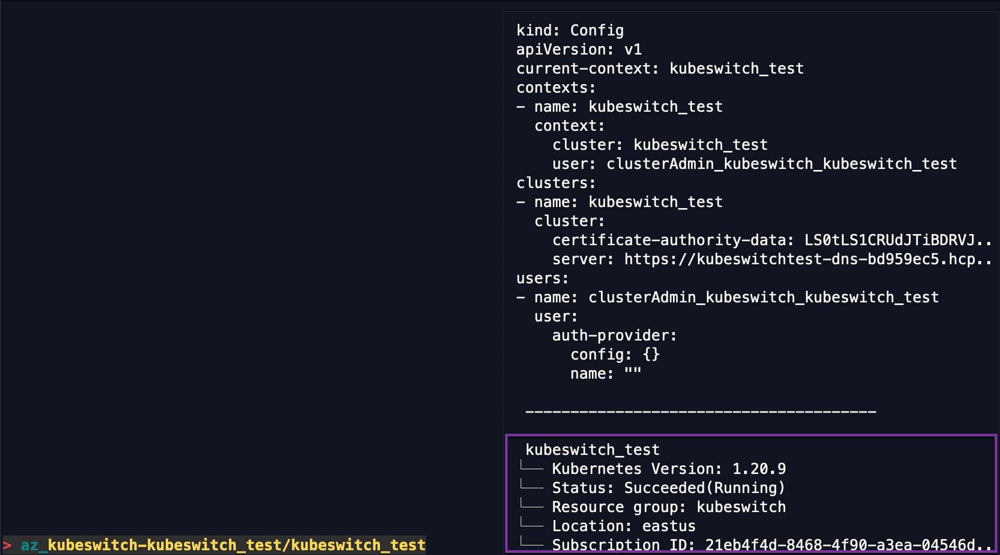

# Azure store

Kubeswitch can discover AKS clusters from Azure.

## Credentials

You can provide your Azure credentials via environment variables.
Please check the [official Azure documentation](https://docs.microsoft.com/en-us/azure/developer/go/azure-sdk-authorization#use-environment-based-authentication) how to provide credentials via environment variables.

If no environment variables with Azure credentials can be found, the locally installed Azure CLI `az` is used to obtain credentials via the browser-based OIDC flow.
Please also note, that you can set a custom path for the Azure CLI via the environment variable `AZURE_CLI`.

## Setup

Please make sure the `az` tool is installed and on your `PATH` if you are 
not setting credentials via environment variables.

Next, create the Azure store configuration in the `kubeswitch` configuration file.

Search over all AKS clusters for a subscription:
```
cat ~/.kube/switch-config.yaml

kind: SwitchConfig
version: "v1alpha1"
kubeconfigStores:
  - kind: azure
    id: <my-id-only-required-if-there-are-multiple-azure-stores>
    config:
      subscriptionID: 21eb4f4d-xyz-xzxz-xzz
```

Limit to certain resource groups:
```
cat ~/.kube/switch-config.yaml

kind: SwitchConfig
version: "v1alpha1"
kubeconfigStores:
  - kind: azure
    id: <my-id-only-required-if-there-are-multiple-azure-stores>
    config:
      subscriptionID: 21eb4f4d-xyz-xzxz-xzz
      resourceGroups:
        - kubeswitch
```

## Multiple subscriptions

Using multiple subscriptions should be possible by defining multiple store configurations in the `switch-config` file (one for each subscription).
Please not, that this is currently an untested scenario.

## Search for AKS Clusters

Kubeconfig context names are fuzzy-searchable using the following semantics. 
The `az_` prefix is an acronym for Azure and helps to narrow down the search to only AKS clusters.

In General:
- `az_<resource-group>-<cluster-name>/<cluster-name>`

Example:
- `az_kubeswitch-kubeswitch_test/kubeswitch_test`

In this example:
- Resource group name: kubeswitch
- AKS Cluster name: kubeswitch_test

However, remember that you can always define an `alias` for each context to define a name that you can better remember or query .

This is how looks like using the `switch` search:
- In addition to the sanitized kubeconfig preview, additional AKS cluster information is shown such as the `Kubernetes version`

