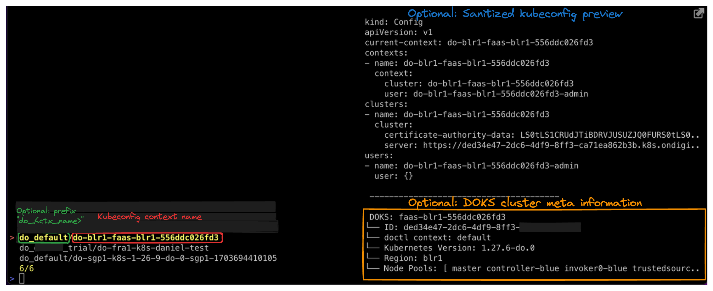

# DigitalOcean store
`Kubeswitch` depends on `doctl` - the official DigitalOcean command line client - for its configuration.
Both `doctl` as well as `Kubeswitch` support multiple different accounts (called `contexts` in `doctl` terms).
If you have set up multiple DigitalOcean accounts with `doctl`, then `Kubeswitch` will discover the DOKS cluster from all accounts.

If you are already using `doctl`, please see the [section for existing `doctl` users below](#existing-doctl-users), otherwise you need to [first setup `doctl`](#how-to-setup-doctl-for-kubeswitch).

Please see below how discovered DOKS clusters are shown in the selection menu:



# Existing `doctl` users

`Kubeswitch` aims to "just work" for existing `doctl` users, hence there is no setup to be done. Just fire-up `kubeswitch` and see the discovered DOKS clusters.
That's being done by parsing the `doctl` created `config.yaml` containing all required information such as the access tokens for each context/account.

**There is one caveat**: the configured access tokens have the [correct scopes](#required-api-access-token-scopes).

# How to setup `doctl` for `kubeswitch`

Kubeswitch re-uses the existing `doctl` configuration including its means of authentication.
`doctl` uses personal API access tokens for authentication.
Hence, first create a personal API access token for your account and register it with `doctl`.
Please see the documentation on how to create a personal access token on DigitalOcean [here](https://docs.digitalocean.com/reference/api/create-personal-access-token/).

### Required API Access token scopes
The API access tokens require at least the following scopes
- Kubernetes: `Read Access`
- Kubernetes: `access_cluster`

### Setup doctl with the API access token
Once you have obtained the access token for your account, setup `doctl` like so:
- if you don't name the context, a default context by the name `default` is created
```bash
doctl auth init --context <my_doctl_context_name_to_identify_this_account> # provide your token in the prompt
```

You can add multiple accounts each with a different `--context`.

# Further configuration

The DigitalOcean store currently has no custom configuration, but supports all default config options like any other store.
For an example default configuration, see below.

```yaml
$ cat ~/.kube/switch-config.yaml

kind: SwitchConfig
version: "v1alpha1"
kubeconfigStores:
- kind: digitalocean
  id: onboarding # 
  refreshIndexAfter: 4h
  showPrefix: true # show the `do_<doctl_context_name> prefix before the kubeconfig context name
  showPreview: true # show a live preview of the kubeconfig and some meta information

```

# Current Limitations

`Kubeswitch` currently only reads the `doctl` created `config.yaml` from [its default location](https://github.com/digitalocean/doctl?tab=readme-ov-file#configuring-default-values). 
- OS X: `${HOME}/Library/Application Support/doctl/config.yaml`
- Linux: `~/.config/doctl/config.yaml` or `${XDG_CONFIG_HOME}/doctl/config.yaml` if the `${XDG_CONFIG_HOME}` environmental variable is set.
- Windows: `%APPDATA%\doctl\config.yaml`

`doctl` specific environment variables such as `DIGITALOCEAN_CONTEXT` or `DIGITALOCEAN_ACCESS_TOKEN` are not supported - the `config.yaml` is the source of truth.
Using `doctl auth init` will write the credentials to the `config.yaml` for `kubeswitch` to discover it.