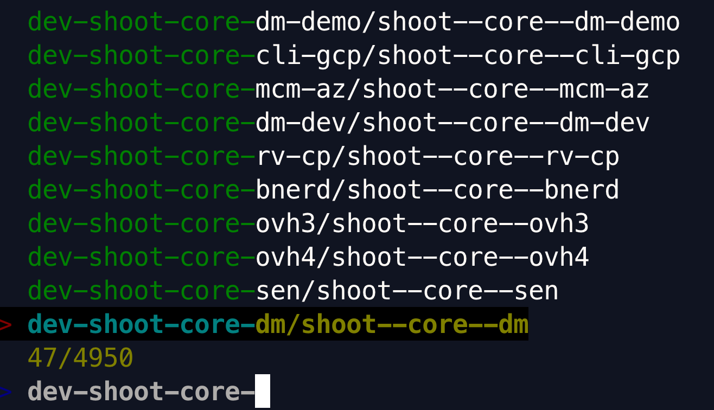
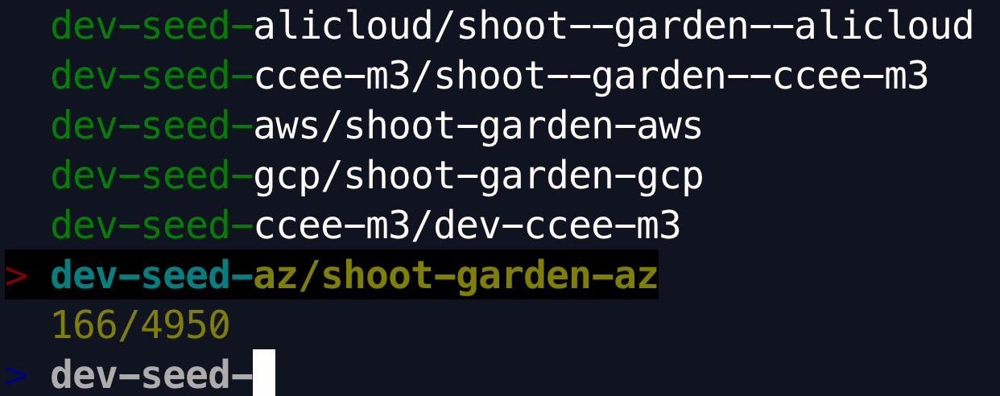
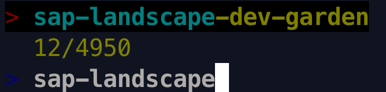
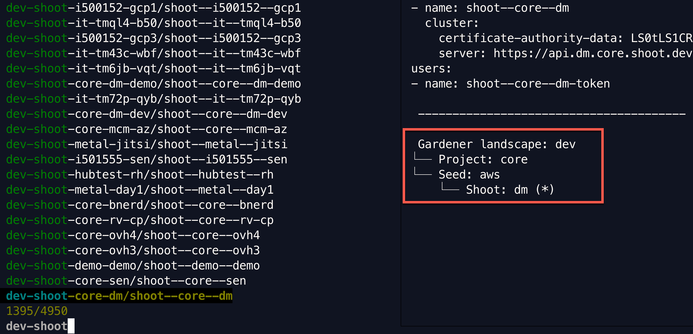

# Configure Gardener store

Kubeswitch can search through multiple [Gardener](https://gardener.cloud) installations for kubeconfigs 
of `Shoot` clusters and `Shooted /Managed Seeds`.
External `Seeds` (not managed) and `Plants` are currently not supported.

## Prerequisites

**Requirements on you local machine** 

- On the client side, you need to have the `Gardenlogin` credentials plugin installed. Please check the [documentation here](https://github.com/gardener/gardenlogin#installation).
For your convenience, the configuration file for the credential-plugin at `$HOME/.garden/gardenlogin.yaml` will be generated based on the `kubeswitch` configuration file .

Please see an example gardenlogin configuration:
```
cat ~/.garden/gardenlogin.yaml
gardens:
    - identity: sap-landscape-dev # must match the landscape-identity from config map in the kube-system namespace in the garden cluster
      kubeconfig: /path/to/garden/kubeconfig
      context: dev-virtual-garden
    - identity: my-other-landscape
      kubeconfig: /path/to/garden/kubeconfig
```

**Requirements for Gardener Installation**
- Since `kubeswitch` version `> 0.5.0` only kubeconfigs with short-lived static tokens are used to access Shoot clusters.
  For this to work, the Gardener API Server must be started with feature gate `AdminKubeconfigRequest` (will be enabled per-default in future versions of Gardener).
  For more information, please see the [GEP](https://github.com/gardener/gardener/blob/master/docs/proposals/16-adminkubeconfig-subresource.md).

**Requirements for Gardener Installation for kubeswitch < 0.7.0**

- Installed [gardenlogin-controller](https://github.com/gardener/gardenlogin-controller-manager)
  - This controller creates the Shoot kubeconfig in the config map with name `<shoot-name>.kubeconfig` in the project namespace in the garden cluster.

**Requirements for Gardener Installation for kubeswitch >= 0.7.0**

- Gardener Installation >= `v1.43.0`

**Background**: Please note that the [gardenlogin-controller](https://github.com/gardener/gardenlogin-controller-manager) has been deprecated (also see [this issue](https://github.com/danielfoehrKn/kubeswitch/issues/38)). 
Since gardener version [v1.43.0](https://github.com/gardener/gardener/releases/tag/v1.43.0), the Shoot's CA secret is synced by the Gardenlet to the Garden cluster into the secret `<shoot-name>.ca-cluster` so that 
clients can construct a Shoot kubeconfig without having to rely on the `gardenlogin-controller`.
As a result, Kubeswitch, starting with version `0.7.0`, does not support `gardenlogin-controller` created kubeconfigs.

## Search Semantics

Kubeconfig contexts names are searchable using Gardener semantics.

The prefix is the identity of the Gardener installation 
(`k -n kube-system get cm cluster-identity` in the Garden cluster).
Optionally, a less technical name can be defined (see [configuration](#configuration)).

**Shoot**
 - <landscape-identity>-shoot-<project-name>-<shoot-name>/<kubeconfig-context>

In this example:
- Landscape-identity: sap-landscape-dev
- Project Name: core
- Shoot Name: dm
- Context Name: shoot--core--dm



**Seed**
- <landscape-identity>-seed-<seed-name>/<kubeconfig-context>

In this example:
- Landscape-identity: sap-landscape-dev
- Seed Name: az
- Context Name: shoot--garden-az



**Garden cluster**
- <landscape-identity>-garden



However, you can always define an [alias](../../../README.md#alias) for a context name to customize the search.
For instance, if you are more used to calling your Gardener cluster "virtual-garden", define an alias like so:

```
switch alias dev-virtual-garden=sap-landscape-dev-garden/virtual-garden
```

Using `switch dev-virtual-garden` will directly switch to the virtual Garden cluster.

## Preview functionality

The preview includes _meta information_ depending on which kubeconfig is selected.
This includes the Gardener landscape, the name of the Seed where the Shoot's control plane runs
and the name of the Shoot.
**Please note**: Using this preview will cause additional requests against the Gardener API server even though
you might use a [search index](../../search_index.md).



The preview can be turned off using the flag `--show-preview false`.

## Switch to the controlplane of a Shoot cluster

If you used `kubeswitch` to switch to any context of a Shoot cluster, you can use the command `switch gardener controlplane` to directly switch to
the controlplane namespace in the Shoot's Seed cluster.

## Configuration 

You need to configure kubeswitch with a kubeconfig for each Gardener installation.
It should have 
- permissions to list `Shoots`, `Secrets` and `ManagedSeeds` (limited to namespaces dependent on the [configured paths](#optional-configuration))
- the current-context set

### Example configuration

```
cat ~/.kube/switch-config.yaml

kind: SwitchConfig
version: "v1alpha1"
refreshIndexAfter: 4h
kubeconfigStores:
- kind: gardener
  config:
    gardenerAPIKubeconfigPath: "/path/to/dev-(virtual)-garden-kubeconfig"
    landscapeName: "dev"
- kind: gardener
  config:
    gardenerAPIKubeconfigPath: "/path/to/canary-(virtual)-garden-kubeconfig"
    landscapeName: "canary"
- kind: gardener
  refreshIndexAfter: 6h
  config:
    gardenerAPIKubeconfigPath: "/path/to/live-(virtual)-garden-kubeconfig"
    landscapeName: "live"
```

### Optional configuration

Optionally, a `landscapeName` can be configured that replaces the automatically detected
`landscape-identity` of each gardener installation.

Per default, all namespaces are searched for Shoot clusters (equals path "/").
You can also define the namespaces in the `paths` field. 

Please see the example below.

```
cat ~/.kube/switch-config.yaml

kind: SwitchConfig
version: "v1alpha1"
refreshIndexAfter: 4h
kubeconfigStores:
- kind: gardener
  paths:
  - "garden-my-shoot-ns"
  - "garden"
  config:
    gardenerAPIKubeconfigPath: "/path/to/dev-(virtual)-garden-kubeconfig"
    landscapeName: "dev"
```
