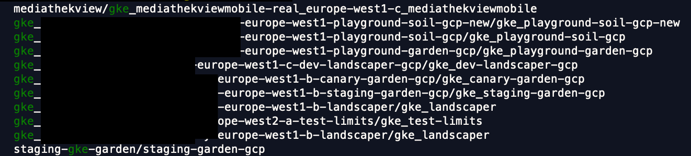

# GKE store

Kubeswitch can discover Google Kubernetes Engine (GKE) clusters wit the help of a locally installed `gcloud` tool.
`gcloud` takes care of the authentication and authorization flow.

## Setup

Please make sure that the `gcloud` tool is installed and on your `PATH`.

Next, create the GKE store configuration in the `kubeswitch` configuration file.
The only currently supported `authenticationType` is `gcloud`.

```
cat ~/.kube/switch-config.yaml

kind: SwitchConfig
version: "v1alpha1"
kubeconfigStores:
  - kind: gke
    id: id-only-required-if-there-are-more-than-one-store
    config:
      # optionally set the account. Otherwise, the currently active gcloud account will be used.
      gcpAccount: my-gcp-account
      authentication:
        authenticationType: gcloud
      # optionally limit to certain projects in account
      projectIDs:
        - project-1
        - project-2
```

## Search for GKE Clusters

Kubeconfig contexts names are searchable using the following semantics.

In General: 
- `gke_<account-name>-<region/zone>-<cluster-name>/gke_<cluster-name>`

Example:
- `gke_sweet-account-europe-west2-a-sweet-cluster/gke_sweet-cluster`

In this example:
- Account name: sweet-account
- Location (zone / region): europe-west-2-a 
  - this is a zone for a zonal cluster and a region for a regional GKE cluster 
- Cluster name: sweet-cluster

However, remember that you can always define an `alias` for each context to define a name that you can better remember / query / like.

This is how looks like using the `switch` search (not that account information has been removed):
